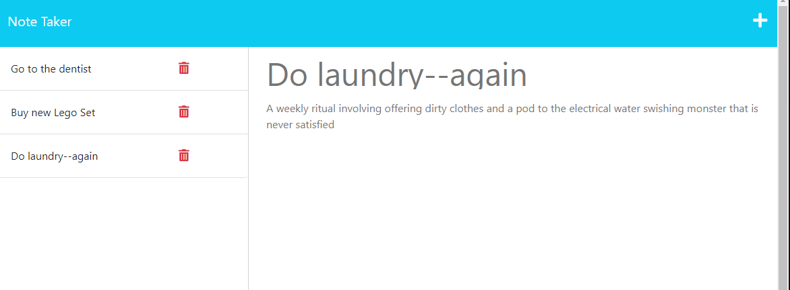

# Express JS Note Maker

[Link to app]()

## Description
Users can input a title and description of chores, save them to a list, and delete them as they are completed. 

## Screenshot

## Installation
* As a web app, no install required.

## Usage
* Open the website.
* Type in a title for a task.
* Type in the description for said task. 
* Click on the save disk icon in the banner to save your task.
* Press the plus button to create a new task.
* Click on the red trashcan icon next to a task you'd like to delete.
* To view details of a previously saved task, click on the task name in the left-hand column. 
* Thanks for using my app!

## References
* [Reference for filter function to remove objects from json database](https://stackoverflow.com/questions/48163429/remove-json-object-from-json-array-element)
* Utilities.js functions created based on review with instructor

## License
Please refer to the license in the repo.

- - -

